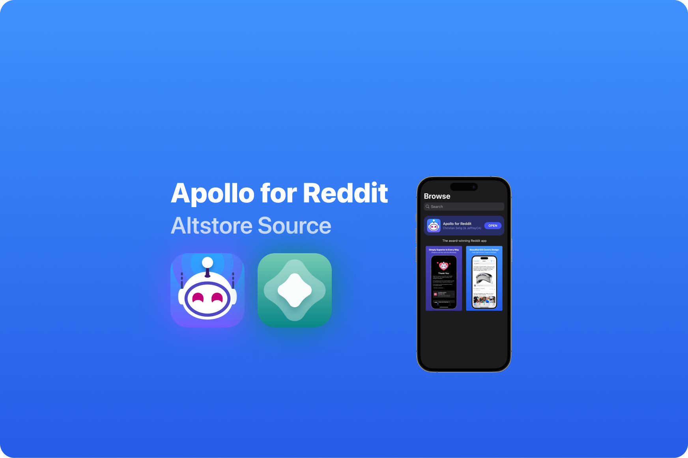
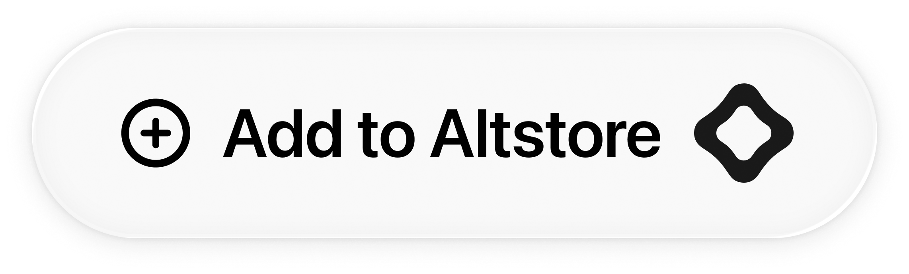
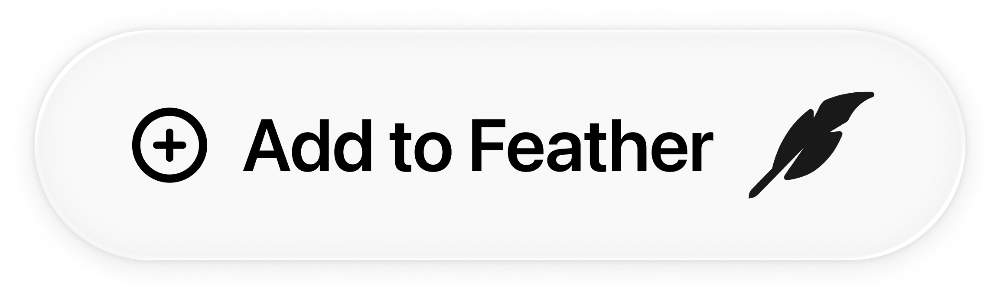
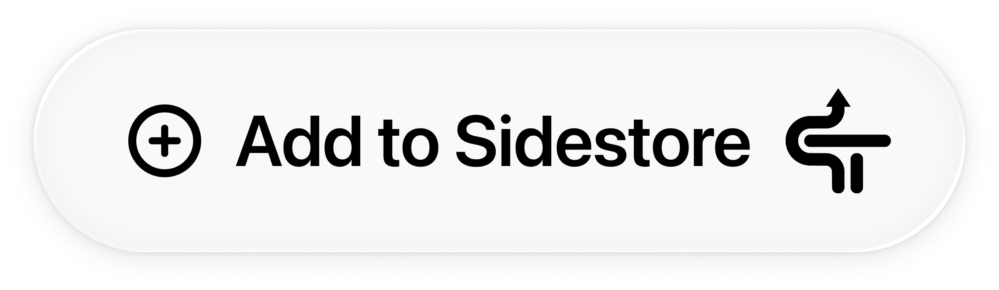
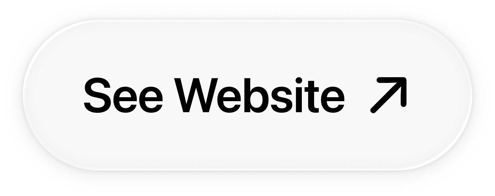

  

# Apollo for Reddit with ImprovedCustomAPI

This AltStore source provides pre-built releases of [Apollo App (Christian Selig)](https://apolloapp.io/) injected with [ImprovedCustomApi (JeffreyCA)](https://github.com/JeffreyCA/Apollo-ImprovedCustomApi).

It uses version `1.15.11` of the app and the latest release of the tweak.

Before raising any issues, please check the [ImprovedCustomApi](https://github.com/JeffreyCA/Apollo-ImprovedCustomApi/issues) repo first - as this source only integrates it.

## Available Sources

| Version | Best For | Features |
|---------|----------|----------|
| **Standard** | Most users | Apollo injected with ImprovedCustomApi |
| **No Extensions** | Free Apple Developer accounts | Apollo injected with ImprovedCustomApi and removed extensions - Uses fewer App IDs (1 vs 7) |
| **GLASS** | iOS 26+ users | Apollo injected with ImprovedCustomApi and Liquid Glass UI Patch (iOS 26+) |
| **No Extensions + LIQUID GLASS** | iOS 26 + Free accounts | Combines both options |

## Standard Source

<a href="https://intradeus.github.io/http-protocol-redirector?r=altstore://source?url=https://raw.githubusercontent.com/Balackburn/Apollo/refs/heads/main/apps.json">
  <picture>
    <source media="(prefers-color-scheme: dark)" srcset="images/buttons/DARK/Altstore.png">
    <source media="(prefers-color-scheme: light)" srcset="images/buttons/LIGHT/Altstore.png">
    
  </picture>
</a>
&nbsp;
<a href="https://intradeus.github.io/http-protocol-redirector?r=feather://source/https://raw.githubusercontent.com/Balackburn/Apollo/refs/heads/main/apps.json">
  <picture>
    <source media="(prefers-color-scheme: dark)" srcset="images/buttons/DARK/Feather.png">
    <source media="(prefers-color-scheme: light)" srcset="images/buttons/LIGHT/Feather.png">
    
  </picture>
</a>
&nbsp;
<a href="https://intradeus.github.io/http-protocol-redirector?r=sidestore://source?url=https://raw.githubusercontent.com/Balackburn/Apollo/refs/heads/main/apps.json">
  <picture>
    <source media="(prefers-color-scheme: dark)" srcset="images/buttons/DARK/Sidestore.png">
    <source media="(prefers-color-scheme: light)" srcset="images/buttons/LIGHT/Sidestore.png">
    
  </picture>
</a>
&nbsp;
<a href="https://raw.githubusercontent.com/Balackburn/Apollo/refs/heads/main/apps.json">
  <picture>
    <source media="(prefers-color-scheme: dark)" srcset="images/buttons/DARK/DirectURL.png">
    <source media="(prefers-color-scheme: light)" srcset="images/buttons/LIGHT/DirectURL.png">
    
  </picture>
</a>

## No Extensions Source (Avoid AppID Limit)

<a href="https://intradeus.github.io/http-protocol-redirector?r=altstore://source?url=https://raw.githubusercontent.com/Balackburn/Apollo/refs/heads/main/apps_noext.json">
  <picture>
    <source media="(prefers-color-scheme: dark)" srcset="images/buttons/DARK/Altstore.png">
    <source media="(prefers-color-scheme: light)" srcset="images/buttons/LIGHT/Altstore.png">
    
  </picture>
</a>
&nbsp;
<a href="https://intradeus.github.io/http-protocol-redirector?r=feather://source/https://raw.githubusercontent.com/Balackburn/Apollo/refs/heads/main/apps_noext.json">
  <picture>
    <source media="(prefers-color-scheme: dark)" srcset="images/buttons/DARK/Feather.png">
    <source media="(prefers-color-scheme: light)" srcset="images/buttons/LIGHT/Feather.png">
    
  </picture>
</a>
&nbsp;
<a href="https://intradeus.github.io/http-protocol-redirector?r=sidestore://source?url=https://raw.githubusercontent.com/Balackburn/Apollo/refs/heads/main/apps_noext.json">
  <picture>
    <source media="(prefers-color-scheme: dark)" srcset="images/buttons/DARK/Sidestore.png">
    <source media="(prefers-color-scheme: light)" srcset="images/buttons/LIGHT/Sidestore.png">
    
  </picture>
</a>
&nbsp;
<a href="https://raw.githubusercontent.com/Balackburn/Apollo/refs/heads/main/apps_noext.json">
  <picture>
    <source media="(prefers-color-scheme: dark)" srcset="images/buttons/DARK/DirectURL.png">
    <source media="(prefers-color-scheme: light)" srcset="images/buttons/LIGHT/DirectURL.png">
    
  </picture>
</a>

## GLASS Source (iOS 26+)

<a href="https://intradeus.github.io/http-protocol-redirector?r=altstore://source?url=https://raw.githubusercontent.com/Balackburn/Apollo/refs/heads/main/apps_glass.json">
  <picture>
    <source media="(prefers-color-scheme: dark)" srcset="images/buttons/DARK/Altstore.png">
    <source media="(prefers-color-scheme: light)" srcset="images/buttons/LIGHT/Altstore.png">
    
  </picture>
</a>
&nbsp;
<a href="https://intradeus.github.io/http-protocol-redirector?r=feather://source/https://raw.githubusercontent.com/Balackburn/Apollo/refs/heads/main/apps_glass.json">
  <picture>
    <source media="(prefers-color-scheme: dark)" srcset="images/buttons/DARK/Feather.png">
    <source media="(prefers-color-scheme: light)" srcset="images/buttons/LIGHT/Feather.png">
    
  </picture>
</a>
&nbsp;
<a href="https://intradeus.github.io/http-protocol-redirector?r=sidestore://source?url=https://raw.githubusercontent.com/Balackburn/Apollo/refs/heads/main/apps_glass.json">
  <picture>
    <source media="(prefers-color-scheme: dark)" srcset="images/buttons/DARK/Sidestore.png">
    <source media="(prefers-color-scheme: light)" srcset="images/buttons/LIGHT/Sidestore.png">
    
  </picture>
</a>
&nbsp;
<a href="https://raw.githubusercontent.com/Balackburn/Apollo/refs/heads/main/apps_glass.json">
  <picture>
    <source media="(prefers-color-scheme: dark)" srcset="images/buttons/DARK/DirectURL.png">
    <source media="(prefers-color-scheme: light)" srcset="images/buttons/LIGHT/DirectURL.png">
    
  </picture>
</a>

## No Extensions + GLASS Source (Avoid AppID Limit - iOS 26+)

<a href="https://intradeus.github.io/http-protocol-redirector?r=altstore://source?url=https://raw.githubusercontent.com/Balackburn/Apollo/refs/heads/main/apps_noext_glass.json">
  <picture>
    <source media="(prefers-color-scheme: dark)" srcset="images/buttons/DARK/Altstore.png">
    <source media="(prefers-color-scheme: light)" srcset="images/buttons/LIGHT/Altstore.png">
    
  </picture>
</a>
&nbsp;
<a href="https://intradeus.github.io/http-protocol-redirector?r=feather://source/https://raw.githubusercontent.com/Balackburn/Apollo/refs/heads/main/apps_noext_glass.json">
  <picture>
    <source media="(prefers-color-scheme: dark)" srcset="images/buttons/DARK/Feather.png">
    <source media="(prefers-color-scheme: light)" srcset="images/buttons/LIGHT/Feather.png">
    
  </picture>
</a>
&nbsp;
<a href="https://intradeus.github.io/http-protocol-redirector?r=sidestore://source?url=https://raw.githubusercontent.com/Balackburn/Apollo/refs/heads/main/apps_noext_glass.json">
  <picture>
    <source media="(prefers-color-scheme: dark)" srcset="images/buttons/DARK/Sidestore.png">
    <source media="(prefers-color-scheme: light)" srcset="images/buttons/LIGHT/Sidestore.png">
    
  </picture>
</a>
&nbsp;
<a href="https://raw.githubusercontent.com/Balackburn/Apollo/refs/heads/main/apps_noext_glass.json">
  <picture>
    <source media="(prefers-color-scheme: dark)" srcset="images/buttons/DARK/DirectURL.png">
    <source media="(prefers-color-scheme: light)" srcset="images/buttons/LIGHT/DirectURL.png">
    
  </picture>
</a>

## Website

<a href="https://balackburn.github.io/Apollo">
  <picture>
    <source media="(prefers-color-scheme: dark)" srcset="images/buttons/DARK/Website.png">
    <source media="(prefers-color-scheme: light)" srcset="images/buttons/LIGHT/Website.png">
    
  </picture>
</a>

This project is not affiliated with Apollo or Christian Selig.
