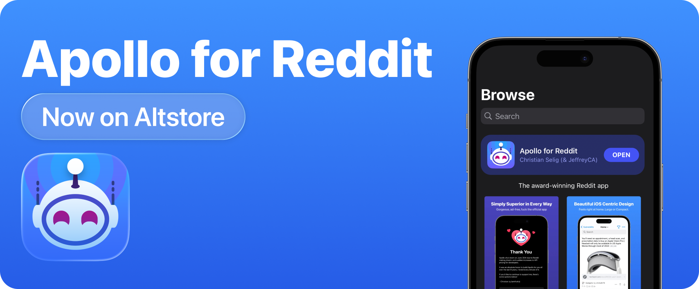
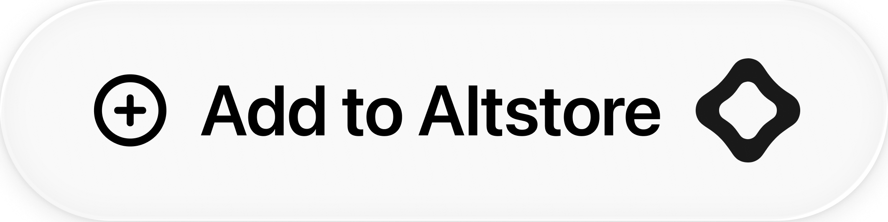
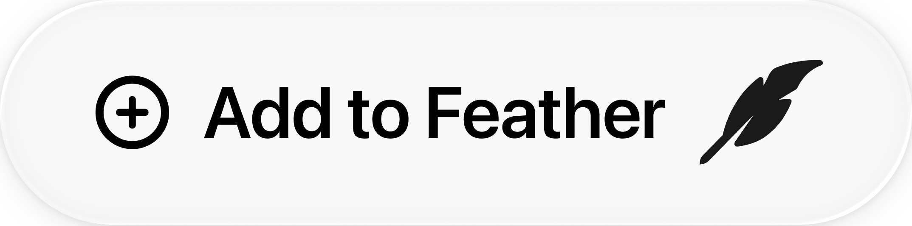
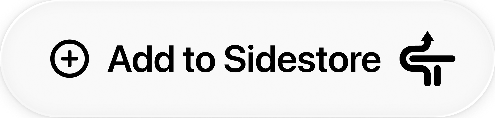

  

# Apollo for Reddit with Apollo-Reborn

This AltStore source distributes [Apollo for Reddit (Christian Selig)](https://apolloapp.io/) powered by the [Apollo-Reborn](https://github.com/Apollo-Reborn/Apollo-Reborn) tweak.

> [!IMPORTANT]
> **ImprovedCustomApi is now [Apollo-Reborn](https://github.com/Apollo-Reborn/Apollo-Reborn).** The tweak is now community-maintained under the Apollo-Reborn org, which builds the official Apollo IPAs and runs its **own website and sources at [apolloreborn.app](https://apolloreborn.app)** (separate from this one).
>
> **This source and repo will keep working for everyone already using it.** The IPAs published here are Apollo-Reborn's official builds, mirrored to this repo's own [releases](https://github.com/Balackburn/Apollo/releases) so existing AltStore / SideStore / Feather subscribers keep auto-updating without changing anything.

The advertised version tracks the Apollo-Reborn tweak version. Before raising any issues, please check the [Apollo-Reborn](https://github.com/Apollo-Reborn/Apollo-Reborn/issues) repo first — as this source only distributes it.

## Available Sources

| Version | Best For | Features |
|---------|----------|----------|
| **Standard** | Most users | Apollo injected with Apollo-Reborn |
| **No Extensions** | Free Apple Developer accounts | Apollo injected with Apollo-Reborn and removed extensions - Uses fewer App IDs (1 vs 7) |
| **GLASS** | iOS 26+ users | Apollo injected with Apollo-Reborn and Liquid Glass UI Patch (iOS 26+) |
| **No Extensions + LIQUID GLASS** | iOS 26 + Free accounts | Combines both options |

> [!NOTE]
> **Standard** and **No Extensions** keep Apollo's classic UIKit appearance, including the bottom-tab swipe-back gesture.
> The **GLASS** variants opt into the iOS 26 Liquid Glass redesign and bundle the Liquid Glass alternate-icon catalog — pick these only on iOS 26+.

## Standard Source

<a href="https://intradeus.github.io/http-protocol-redirector?r=altstore://source?url=https://raw.githubusercontent.com/Balackburn/Apollo/refs/heads/main/apps.json">
  <picture>
    <source media="(prefers-color-scheme: dark)" srcset="public/images/buttons/DARK/Altstore.png">
    <source media="(prefers-color-scheme: light)" srcset="public/images/buttons/LIGHT/Altstore.png">
    
  </picture>
</a>
&nbsp;
<a href="https://intradeus.github.io/http-protocol-redirector?r=feather://source/https://raw.githubusercontent.com/Balackburn/Apollo/refs/heads/main/apps.json">
  <picture>
    <source media="(prefers-color-scheme: dark)" srcset="public/images/buttons/DARK/Feather.png">
    <source media="(prefers-color-scheme: light)" srcset="public/images/buttons/LIGHT/Feather.png">
    
  </picture>
</a>
&nbsp;
<a href="https://intradeus.github.io/http-protocol-redirector?r=sidestore://source?url=https://raw.githubusercontent.com/Balackburn/Apollo/refs/heads/main/apps.json">
  <picture>
    <source media="(prefers-color-scheme: dark)" srcset="public/images/buttons/DARK/Sidestore.png">
    <source media="(prefers-color-scheme: light)" srcset="public/images/buttons/LIGHT/Sidestore.png">
    
  </picture>
</a>
&nbsp;
<a href="https://raw.githubusercontent.com/Balackburn/Apollo/refs/heads/main/apps.json">
  <picture>
    <source media="(prefers-color-scheme: dark)" srcset="public/images/buttons/DARK/DirectURL.png">
    <source media="(prefers-color-scheme: light)" srcset="public/images/buttons/LIGHT/DirectURL.png">
    
  </picture>
</a>

## No Extensions Source (Avoid AppID Limit)

<a href="https://intradeus.github.io/http-protocol-redirector?r=altstore://source?url=https://raw.githubusercontent.com/Balackburn/Apollo/refs/heads/main/apps_noext.json">
  <picture>
    <source media="(prefers-color-scheme: dark)" srcset="public/images/buttons/DARK/Altstore.png">
    <source media="(prefers-color-scheme: light)" srcset="public/images/buttons/LIGHT/Altstore.png">
    
  </picture>
</a>
&nbsp;
<a href="https://intradeus.github.io/http-protocol-redirector?r=feather://source/https://raw.githubusercontent.com/Balackburn/Apollo/refs/heads/main/apps_noext.json">
  <picture>
    <source media="(prefers-color-scheme: dark)" srcset="public/images/buttons/DARK/Feather.png">
    <source media="(prefers-color-scheme: light)" srcset="public/images/buttons/LIGHT/Feather.png">
    
  </picture>
</a>
&nbsp;
<a href="https://intradeus.github.io/http-protocol-redirector?r=sidestore://source?url=https://raw.githubusercontent.com/Balackburn/Apollo/refs/heads/main/apps_noext.json">
  <picture>
    <source media="(prefers-color-scheme: dark)" srcset="public/images/buttons/DARK/Sidestore.png">
    <source media="(prefers-color-scheme: light)" srcset="public/images/buttons/LIGHT/Sidestore.png">
    
  </picture>
</a>
&nbsp;
<a href="https://raw.githubusercontent.com/Balackburn/Apollo/refs/heads/main/apps_noext.json">
  <picture>
    <source media="(prefers-color-scheme: dark)" srcset="public/images/buttons/DARK/DirectURL.png">
    <source media="(prefers-color-scheme: light)" srcset="public/images/buttons/LIGHT/DirectURL.png">
    
  </picture>
</a>

## GLASS Source (iOS 26+)

<a href="https://intradeus.github.io/http-protocol-redirector?r=altstore://source?url=https://raw.githubusercontent.com/Balackburn/Apollo/refs/heads/main/apps_glass.json">
  <picture>
    <source media="(prefers-color-scheme: dark)" srcset="public/images/buttons/DARK/Altstore.png">
    <source media="(prefers-color-scheme: light)" srcset="public/images/buttons/LIGHT/Altstore.png">
    
  </picture>
</a>
&nbsp;
<a href="https://intradeus.github.io/http-protocol-redirector?r=feather://source/https://raw.githubusercontent.com/Balackburn/Apollo/refs/heads/main/apps_glass.json">
  <picture>
    <source media="(prefers-color-scheme: dark)" srcset="public/images/buttons/DARK/Feather.png">
    <source media="(prefers-color-scheme: light)" srcset="public/images/buttons/LIGHT/Feather.png">
    
  </picture>
</a>
&nbsp;
<a href="https://intradeus.github.io/http-protocol-redirector?r=sidestore://source?url=https://raw.githubusercontent.com/Balackburn/Apollo/refs/heads/main/apps_glass.json">
  <picture>
    <source media="(prefers-color-scheme: dark)" srcset="public/images/buttons/DARK/Sidestore.png">
    <source media="(prefers-color-scheme: light)" srcset="public/images/buttons/LIGHT/Sidestore.png">
    
  </picture>
</a>
&nbsp;
<a href="https://raw.githubusercontent.com/Balackburn/Apollo/refs/heads/main/apps_glass.json">
  <picture>
    <source media="(prefers-color-scheme: dark)" srcset="public/images/buttons/DARK/DirectURL.png">
    <source media="(prefers-color-scheme: light)" srcset="public/images/buttons/LIGHT/DirectURL.png">
    
  </picture>
</a>

## No Extensions + GLASS Source (Avoid AppID Limit - iOS 26+)

<a href="https://intradeus.github.io/http-protocol-redirector?r=altstore://source?url=https://raw.githubusercontent.com/Balackburn/Apollo/refs/heads/main/apps_noext_glass.json">
  <picture>
    <source media="(prefers-color-scheme: dark)" srcset="public/images/buttons/DARK/Altstore.png">
    <source media="(prefers-color-scheme: light)" srcset="public/images/buttons/LIGHT/Altstore.png">
    
  </picture>
</a>
&nbsp;
<a href="https://intradeus.github.io/http-protocol-redirector?r=feather://source/https://raw.githubusercontent.com/Balackburn/Apollo/refs/heads/main/apps_noext_glass.json">
  <picture>
    <source media="(prefers-color-scheme: dark)" srcset="public/images/buttons/DARK/Feather.png">
    <source media="(prefers-color-scheme: light)" srcset="public/images/buttons/LIGHT/Feather.png">
    
  </picture>
</a>
&nbsp;
<a href="https://intradeus.github.io/http-protocol-redirector?r=sidestore://source?url=https://raw.githubusercontent.com/Balackburn/Apollo/refs/heads/main/apps_noext_glass.json">
  <picture>
    <source media="(prefers-color-scheme: dark)" srcset="public/images/buttons/DARK/Sidestore.png">
    <source media="(prefers-color-scheme: light)" srcset="public/images/buttons/LIGHT/Sidestore.png">
    
  </picture>
</a>
&nbsp;
<a href="https://raw.githubusercontent.com/Balackburn/Apollo/refs/heads/main/apps_noext_glass.json">
  <picture>
    <source media="(prefers-color-scheme: dark)" srcset="public/images/buttons/DARK/DirectURL.png">
    <source media="(prefers-color-scheme: light)" srcset="public/images/buttons/LIGHT/DirectURL.png">
    
  </picture>
</a>

## Website

<a href="https://balackburn.github.io/Apollo">
  <picture>
    <source media="(prefers-color-scheme: dark)" srcset="public/images/buttons/DARK/Website.png">
    <source media="(prefers-color-scheme: light)" srcset="public/images/buttons/LIGHT/Website.png">
    
  </picture>
</a>

##
This project is not affiliated with Apollo or Christian Selig.
